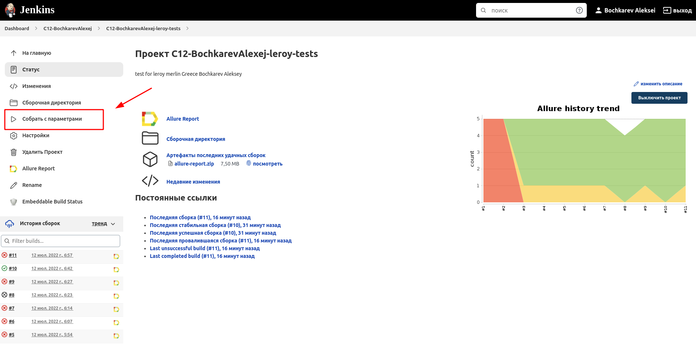
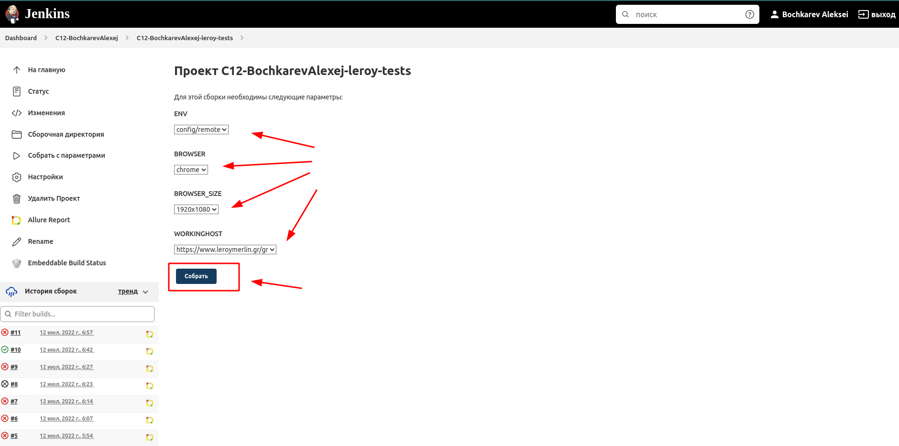
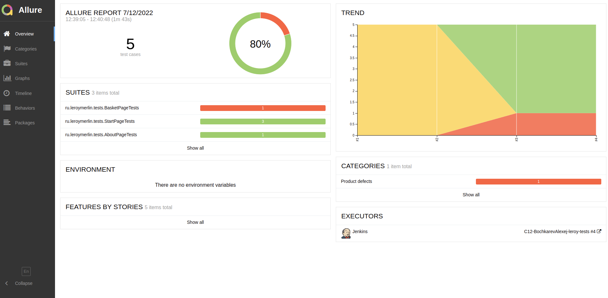
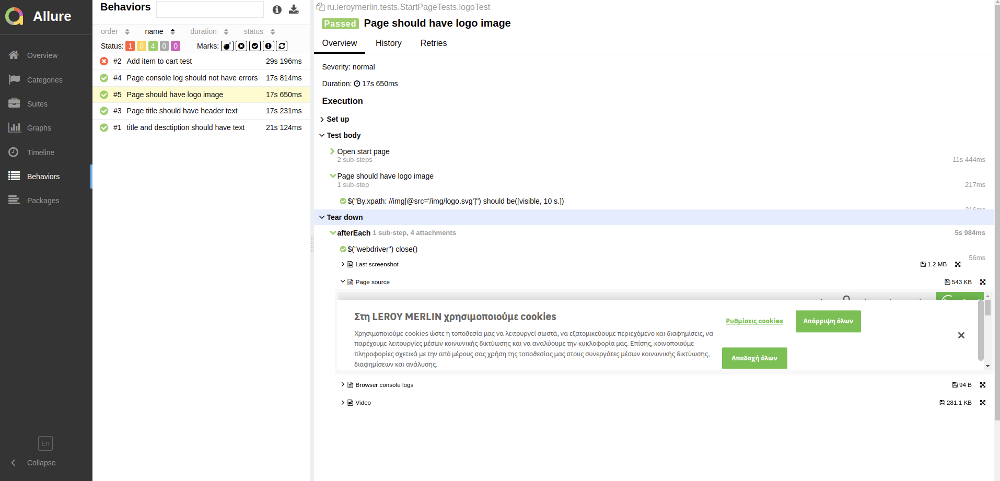
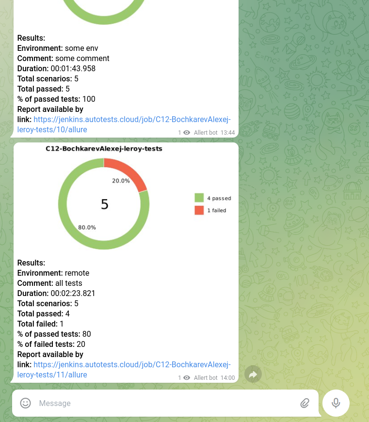
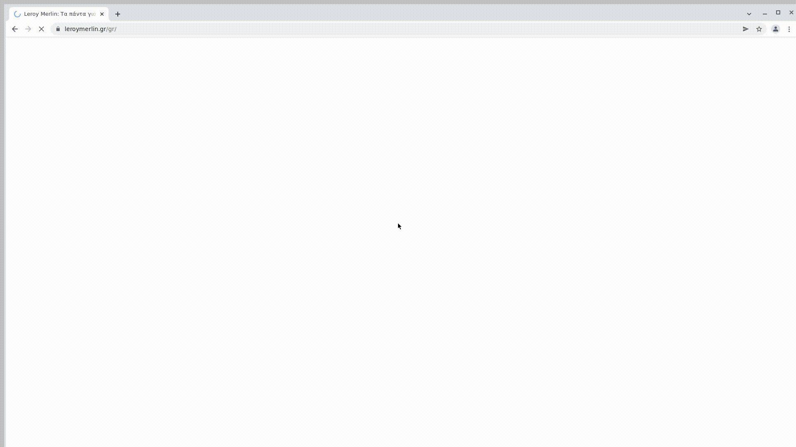

# Автотест Leroy Merlin Greece
## :link:  <a target="_blank" href=https://www.leroymerlin.gr/gr>Leroy Merlin Greece</a>


## :page_with_curl: Содержание:

- <a href="#computer-сode_stack">Code stack</a>
- <a href="#computer-infrastructure_stack">Infrastructure stack</a>
- <a href="#clipboard-реализованные-проверки">Реализованные проверки</a>
- <a href="#robot-сборки-в-Jenkins">Сборки в Jenkins</a>
- <a href="#keyboard-запуск-из-терминала">Запуск из терминала</a>
- <a href="#bar_chart-allure-отчет">Allure отчет</a>
- <a href="#robot-отчет-в-telegram">Отчет в Telegram</a>
- <a href="#film_projector-видео-пример-прохождения-тестов">Видео пример прохождения тестов</a>

## :computer: Code stack
<p align="left">


</p>

## :computer: Infrastructure stack
<p align="left">


</p>

## :clipboard: Реализованные проверки
  -  Проверка отсутствия в консоле errors
  -  Проверка наличия тайтла на главной странице
  -  Проверка наличия лого на главной странице
  -  Проверка тайтла на странице о компании
  -  Проверка функции добавления товара в корзину
    
## :robot: Сборки в Jenkins
### <a target="_blank" href="https://jenkins.autotests.cloud/view/C12-BochkarevAlexej/job/C12-BochkarevAlexej-leroy-tests/">Параметризированная сборка в Jenkins</a>
*Для запуска сборки необходимо указать значения параметров и нажать кнопку <code><strong>*Собрать с параметрами*</strong></code>.*

<p align="center">
  
</p>

<p align="center">
  
</p>

## :keyboard: Запуск из терминала
Локальный запуск всех тестов:
```
gradle clean test -Denv=config/local
```

Удаленный запуск всех тестов:
```
clean
test
 -Denv=${ENV}
 -Dbrowser=${BROWSER}
 -DbrowserSize=${BROWSER_SIZE}
 -DworkingHost=${WORKINGHOST}
 ```

### Параметры сборки

> <code>ENV</code> – окружение, в котором буду запускаться тесты (локально или удаленно) (_по умолчанию - <code>remote</code>_).
>
> <code>BROWSER</code> – браузер, в котором будут выполняться тесты (_по умолчанию - <code>chrome</code>_).
>
> <code>BROWSER_SIZE</code> – разрешени окна браузера, в котором будут выполняться тесты (_по умолчанию - <code>1920x1080</code>_).
>
> <code>WORKINGHOST</code> – адрес ресурса, который будет проветестирован.
>

## :bar_chart: Allure отчет
- ### Главный экран отчета
<p align="center">

</p>

- ### Страница с проведенными тестами
<p align="center">

</p>

## :robot: Отчет в Telegram
- ### Telegram notification message (all results)
<p align="center">

</p>

## :film_projector: Видео пример прохождения тестов
> К каждому тесту в отчете прилагается видео. Одно из таких видео представлено ниже.
<p align="center">
  
</p>
